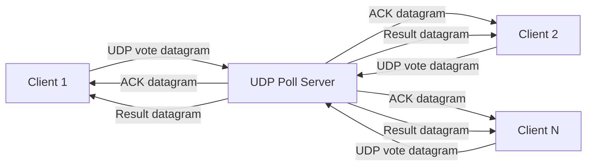

# Live Polling and Voting System (Python)

Secure real-time polling system where clients submit votes over UDP datagrams, and the server aggregates and rebroadcasts results, with a live Flask dashboard for visualization.

## Features

- Custom binary vote packet format with CRC32 integrity checks.
- Reliability support using ACK responses and client retries.
- Fixed voting options: A, B, and C.
- Duplicate vote detection per `(client_id, sequence)` semantics within a poll (duplicates are ignored).
- Statistical packet loss estimate per client using sequence gaps.
- Periodic result broadcasting to connected clients over UDP.
- Live Flask dashboard with smooth animated charts and real-time polling updates.

## Rubric Alignment Summary

- Socket programming: Uses low-level UDP sockets directly in Python.
- Concurrency: Supports multiple concurrent clients with a datagram-based server loop.
- Protocol design: Uses a custom binary packet format with explicit framing and CRC validation.
- Performance evaluation: Includes a benchmark script with latency and throughput metrics.

## Project Structure

The implementation is split into four modules:

- Server module: `app/server.py`, `app/engine.py`, `app/protocol.py`, `app/transport.py`
- Client module: `app/client.py`, demo flow in `app/main.py`
- Benchmark module: `scripts/benchmark_udp.py`
- Dashboard module: `app/web.py`, `templates/`, `static/` for the HTTP visualization layer

Supporting files:

- `app/protocol.py`: Custom packet format (vote, ack, result) plus length framing.
- `app/engine.py`: Vote aggregation, duplicate detection, loss analysis.
- `app/server.py`: UDP server and periodic result broadcaster.
- `app/client.py`: Retry-enabled UDP voting client.
- `app/transport.py`: Framed socket helpers.
- `app/main.py`: CLI entry point to run server or demo client.
- `app/web.py`: Flask dashboard API and UI routes.
- `tests/`: Required test cases from assignment + protocol checks.

## Setup

1. Create venv and install dependencies:

```bash
python3 -m venv .venv
source .venv/bin/activate
pip install -r requirements.txt
```

2. Start the UDP server:

```bash
python -m app.main server --host 0.0.0.0 --port 9999 --web-host 0.0.0.0 --web-port 8443
```

3. Send a demo vote:

```bash
python -m app.main client-demo --host 127.0.0.1 --port 9999 --listen-seconds 4
```

Dashboard login users are loaded from `users.json`. Add as many username/password pairs as needed.

4. Open dashboard:

- Local: `http://127.0.0.1:8443`
- LAN device: `http://<your-laptop-ip>:8443`

The dashboard is served over plain HTTP for the project demo.

Vote option mapping used by the server:

- `1` => `A`
- `2` => `B`
- `3` => `C`

## Tests

Run all tests:

```bash
pytest -q
```

Included assignment test cases:

- Custom vote packet format: `tests/test_protocol.py::test_custom_vote_packet_roundtrip`
- Duplicate detection: `tests/test_engine.py::test_duplicate_detection`
- Statistical loss analysis: `tests/test_engine.py::test_statistical_loss_analysis`
- Periodic result broadcasting: `tests/test_broadcast.py::test_periodic_result_broadcast_packet_content`
- Fixed option constraints (A/B/C): `tests/test_engine.py::test_invalid_option_is_rejected`

## Architecture



The server uses a datagram receive loop and a separate broadcast thread for periodic result snapshots.

## Performance Evaluation

Use the benchmark script after starting the UDP server:

```bash
python scripts/benchmark_udp.py --host 127.0.0.1 --port 9999 --clients 50 --concurrency 10
```

It reports average latency and throughput so you can include measured results in the final demo report.

## Final Submission Writeup

Include these points in your final report:

- Problem statement and why the socket-based UDP design was chosen.
- Architecture summary with the client, server, protocol, and dashboard flow.
- Core features implemented: custom packets, ACK handling, duplicate detection, broadcasts, and UDP transport.
- Performance notes from the benchmark script, especially latency and throughput under multiple clients.
- A short clarification that the loss metric is a sequence-gap estimate and that the dashboard is an HTTP visualization layer.

A simple benchmark summary format you can use:

- Test setup: number of clients, concurrency, host, and port.
- Observations: average latency, throughput, and whether results stayed stable under load.
- Conclusion: whether the system handled concurrent voting as expected.

## Voting From Other Devices

1. Start the server with `--host 0.0.0.0`.
2. Ensure all devices are on the same network.
3. Copy `certs/cert.pem` to each client device.
4. Run vote command from another device:

```bash
python -m app.main client-demo --host <server-ip> --port 9999 --client-id 2001 --option B --listen-seconds 1
```

## Team Work Split Suggestion (3 members)

- Member 1: UDP protocol + client reliability (`app/protocol.py`, `app/client.py`, `app/transport.py`)
- Member 2: Aggregation + analytics + tests (`app/engine.py`, `tests/`)
- Member 3: CLI/runtime wiring + broadcast flow (`app/main.py`, `app/server.py`)

## Submission Note

For final evaluation, include:

- Source code in the repository
- Setup and run steps
- Architecture diagram
- Benchmark observations (latency and throughput)
