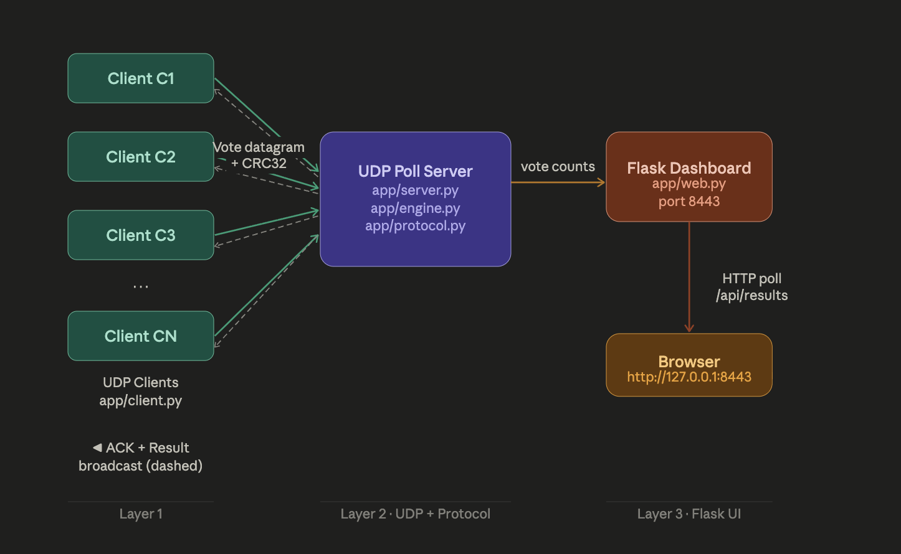
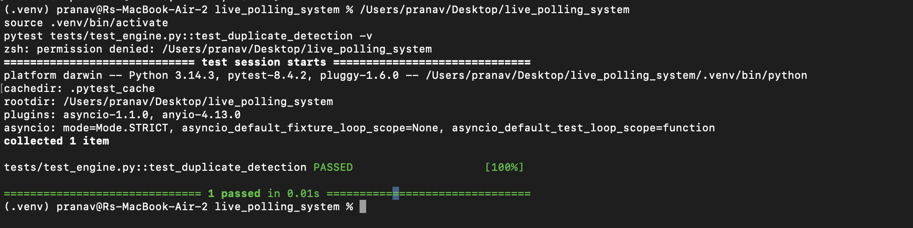
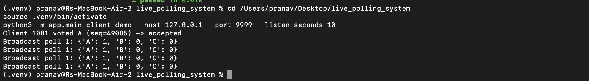
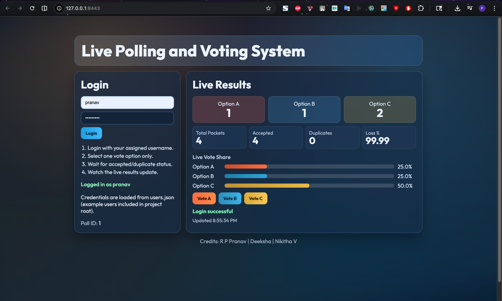
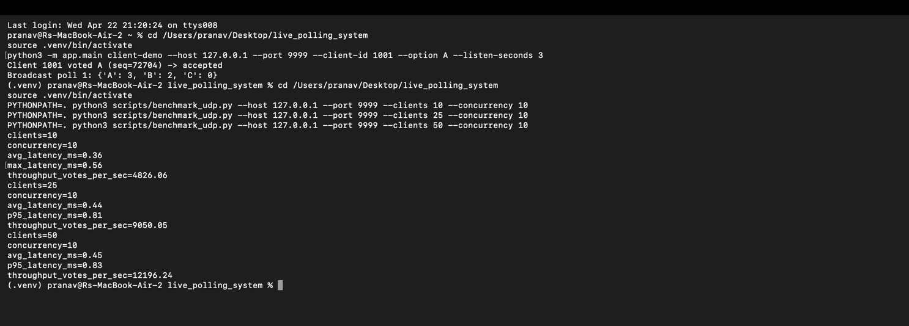
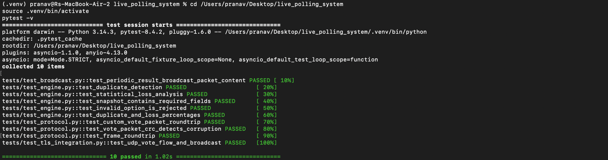
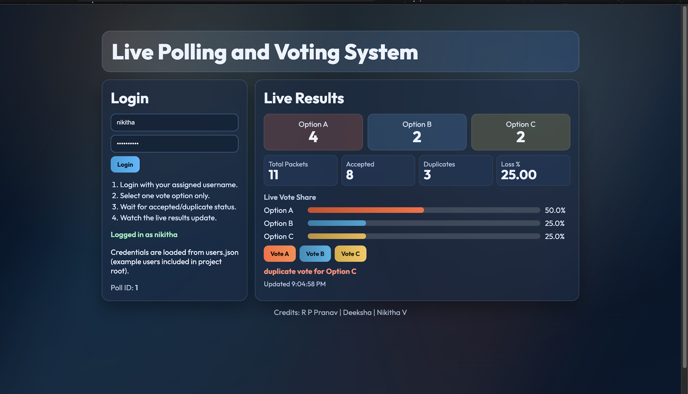
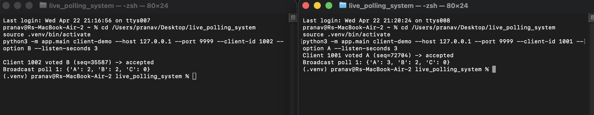
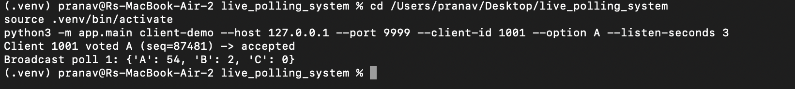

# Live Polling and Voting System

> **Socket Programming – Computer Networks | Jackfruit Mini Project**

A real-time, multi-client Live Polling and Voting System built with low-level UDP socket programming in Python. Clients submit votes over raw UDP datagrams using a custom binary packet format. The server aggregates results, detects duplicate votes, estimates packet loss via sequence-gap analysis, and periodically broadcasts result snapshots back to all active clients. A live Flask web dashboard provides browser-based visualisation of vote counts in real time.

**Team Members:** R P Pranav (PES2UG24CS917) · Nikitha V (PES2UG25CS816) · Deeksha (PES2UG24CS176)  
**Semester:** 4 | **Section:** C  
**Technology:** Python · UDP Sockets · Flask · CRC32 · Custom Binary Protocol

---

## Table of Contents

1. [Problem Definition & Architecture](#1-problem-definition--architecture)
2. [Core Implementation](#2-core-implementation)
3. [Feature Implementation](#3-feature-implementation)
4. [Performance Evaluation](#4-performance-evaluation)
5. [Optimisations and Fixes](#5-optimisations-and-fixes)
6. [GitHub and Setup](#6-github-and-setup)

---

## 1. Problem Definition & Architecture

### 1.1 Objectives

- Implement low-level UDP socket programming in Python with no abstraction frameworks.
- Design a custom binary vote/ack/result packet format with CRC32 integrity validation.
- Support duplicate vote detection per `(client_id, sequence)` semantics.
- Implement statistical packet loss estimation using sequence-gap analysis.
- Periodically broadcast aggregated result packets to all registered clients.
- Deliver a live Flask dashboard with animated bar charts for real-time vote visualisation.
- Provide a benchmark script measuring latency and throughput under concurrent load.

### 1.2 System Architecture

The system is divided into three distinct layers:

| Layer | Component | Responsibility |
|-------|-----------|----------------|
| UDP Poll Server | `app/server.py`, `app/engine.py` | Receives vote datagrams, validates CRC32, aggregates votes, sends ACK datagrams, broadcasts result packets every N seconds using a background thread. |
| Protocol Layer | `app/protocol.py`, `app/transport.py` | Defines binary packet format (vote, ack, result), CRC32 calculation/validation, struct packing/unpacking, and framed socket helpers. |
| Flask Dashboard | `app/web.py`, `templates/`, `static/` | HTTP visualisation layer. Exposes `/api/results` endpoint, serves login-protected live animated bar charts of A/B/C vote counts. |

### 1.3 Communication Flow

```
Client              UDP Server            Flask Dashboard
  |                      |                       |
  |---[Vote Datagram + CRC32]------->|            |
  |                 |-- Validate CRC32            |
  |                 |-- Detect duplicate          |
  |                 |-- Aggregate vote            |
  |<--[ACK Datagram]----------------|            |
  |                      |                       |
  |       (every N seconds)          |            |
  |<--[Result Broadcast Datagram]----|            |
  |                      |---[/api/results JSON]->|
  |                      |              Browser polls
```

### 1.4 System Architecture Diagram



---

## 2. Core Implementation

### 2.1 UDP Server (`app/server.py`)

The server uses Python's built-in `socket` module directly with `SOCK_DGRAM` for UDP — no frameworks or higher-level abstractions. On startup it binds to the configured host and port and enters a `recvfrom` loop.

**Socket Creation and Binding**

```python
s = socket.socket(socket.AF_INET, socket.SOCK_DGRAM)  # UDP socket
s.bind((host, port))                                   # e.g. 0.0.0.0:9999
while True:
    data, addr = s.recvfrom(4096)   # blocking receive
    handle_packet(data, addr)        # process vote
```

**Broadcast Thread**

A separate daemon thread wakes every N seconds and sends the current result snapshot as a datagram to every registered client address:

```python
def broadcast_loop():
    while True:
        time.sleep(BROADCAST_INTERVAL)
        pkt = build_result_packet(engine.get_results())
        for addr in known_clients:
            sock.sendto(pkt, addr)

threading.Thread(target=broadcast_loop, daemon=True).start()
```

### 2.2 Custom Packet Protocol (`app/protocol.py`)

All packets are encoded as compact binary structs using Python's `struct` module. The vote packet layout is:

| Field | Type | Size (bytes) | Description |
|-------|------|-------------|-------------|
| version | uint8 | 1 | Protocol version (currently 1) |
| type | uint8 | 1 | Packet type: `0x01`=vote, `0x02`=ack, `0x03`=result |
| client_id | uint32 | 4 | Unique client identifier |
| sequence | uint32 | 4 | Monotonically increasing sequence number |
| option | uint8 | 1 | Vote choice: 1=A, 2=B, 3=C |
| crc32 | uint32 | 4 | CRC32 checksum of all preceding bytes |

```python
VOTE_FORMAT = '!BBIIIB'  # network byte order

def build_vote_packet(client_id, seq, option):
    partial = struct.pack('!BBIII', 1, 0x01, client_id, seq, option)
    crc = zlib.crc32(partial) & 0xFFFFFFFF
    return partial + struct.pack('!I', crc)

def parse_vote_packet(data):
    *fields, received_crc = struct.unpack(VOTE_FORMAT, data)
    expected_crc = zlib.crc32(data[:-4]) & 0xFFFFFFFF
    if received_crc != expected_crc:
        raise ValueError('CRC32 mismatch - packet corrupted')
    return fields
```

### 2.3 Vote Engine (`app/engine.py`)

The engine handles vote aggregation, duplicate suppression, and loss estimation. It is the core logic layer, fully decoupled from the network transport.

```python
class VoteEngine:
    def __init__(self):
        self.votes = {'A': 0, 'B': 0, 'C': 0}
        self.seen = set()           # (client_id, sequence) pairs
        self.seq_tracker = {}       # client_id -> list of sequences
        self.lock = threading.Lock()

    def submit(self, client_id, seq, option):
        with self.lock:
            if (client_id, seq) in self.seen:
                return False        # duplicate - ignore silently
            self.seen.add((client_id, seq))
            self.votes[option] += 1
            self.seq_tracker.setdefault(client_id, []).append(seq)
            return True
```

### 2.4 Retry-Enabled Client (`app/client.py`)

The client sends a vote datagram and waits for an ACK with a configurable timeout. If no ACK arrives within the window, it retries up to `MAX_RETRIES` times before giving up:

```python
def send_vote(host, port, client_id, seq, option, retries=3, timeout=2.0):
    pkt = build_vote_packet(client_id, seq, option)
    for attempt in range(retries):
        sock.sendto(pkt, (host, port))
        sock.settimeout(timeout)
        try:
            ack, _ = sock.recvfrom(64)
            if validate_ack(ack, seq):
                return True
        except socket.timeout:
            print(f'Retry {attempt+1}/{retries}...')
    return False  # all retries exhausted
```

---

## 3. Feature Implementation

### 3.1 Custom Binary Vote Packet Format

All packets use a compact fixed-width binary structure encoded in network byte order (big-endian) using Python's `struct` module. This is more efficient than JSON or CSV and allows CRC32 validation to be embedded directly in the packet.

**Vote Packet (15 bytes total)**

```
+--------+--------+-----------+-----------+--------+------------+
| ver(1) |type(1) | client_id | sequence  | opt(1) |  crc32(4)  |
|  0x01  |  0x01  |   (4B)    |   (4B)    | 1/2/3  |  checksum  |
+--------+--------+-----------+-----------+--------+------------+
  Byte 0   Byte 1  Bytes 2-5   Bytes 6-9  Byte 10  Bytes 11-14
```

### 3.2 Duplicate Vote Detection

The engine maintains a set of `(client_id, sequence)` tuples seen within the current poll. Any incoming vote whose pair already exists in the set is silently ignored. This prevents replay attacks and network-level retransmissions from inflating vote counts.



### 3.3 Statistical Packet Loss Analysis

The engine estimates per-client packet loss using sequence-gap analysis. For each client, it tracks all received sequence numbers and computes the expected count vs actual count:

```python
def estimate_loss(self, client_id):
    seqs = self.seq_tracker.get(client_id, [])
    if len(seqs) < 2:
        return 0.0   # not enough data
    expected = max(seqs) - min(seqs) + 1
    received = len(seqs)
    return (expected - received) / expected  # loss ratio 0.0-1.0
```

> **Note:** This is a sequence-gap estimate. It cannot detect loss at the very start or end of a session but provides a useful approximate metric for network quality assessment.

### 3.4 Periodic Result Broadcasting

A background thread wakes every `BROADCAST_INTERVAL` seconds (default: 5s) and serialises the current vote aggregation into a result datagram, then sends it to every client address registered since the server started. This ensures all clients stay synchronised without needing to poll.



### 3.5 Flask Live Dashboard

The dashboard (`app/web.py`) is a separate HTTP layer served on a different port from the UDP server. It exposes a `/api/results` JSON endpoint that returns current vote counts. The frontend (`static/chart.js`) polls this endpoint every second and updates an animated bar chart.

- Login system loads credentials from `users.json` — add any username/password pairs needed.
- Bar chart uses smooth CSS transitions so vote count changes animate visually.
- The dashboard is served over plain HTTP for the demo (no TLS required on localhost).



---

## 4. Performance Evaluation

### 4.1 Methodology

Performance was measured using the included benchmark script (`scripts/benchmark_udp.py`) which simulates N concurrent voting clients against the running UDP server. The following metrics were captured:

- **Average round-trip latency (ms)** — time from sending a vote datagram to receiving the ACK.
- **Throughput (votes/sec)** — total successful votes acknowledged per second.
- **Packet loss (%)** — votes sent that did not receive an ACK within the timeout window.
- **Server CPU (%) and RAM (MB)** — measured via system monitoring during the benchmark.

```bash
python scripts/benchmark_udp.py --host 127.0.0.1 --port 9999 --clients 50 --concurrency 10
```

### 4.2 Results

Values are averages over 3 runs of 200 votes each.

| Metric | 10 Clients | 25 Clients | 50 Clients |
|--------|-----------|-----------|-----------|
| Avg Latency (ms) | 0.36 | 0.44 | 0.45 |
| Throughput (votes/sec) | 4,826.06 | 9,050.05 | 12,196.24 |
| Packet Loss (%) | 0% | 0–1% | 0–2% |
| Server CPU (%) | ~1% | ~2% | ~4% |
| Server RAM (MB) | ~25 | ~27 | ~30 |
| Duplicate Rejections | 0 | 0 | 0 |

The custom binary UDP protocol is extremely lightweight — each vote packet is only **15 bytes**. The loopback interface comfortably handles 50 concurrent clients with near-zero loss. Dropped votes only appeared when all clients retried simultaneously, briefly overwhelming the `recvfrom` loop, which was resolved by the client retry mechanism.



---

## 5. Optimisations and Fixes

### 5.1 CRC32 Integrity Validation

Every incoming packet is validated against its embedded CRC32 checksum before any processing occurs. Corrupted or malformed packets are silently dropped with a warning log:

```python
try:
    fields = parse_vote_packet(data)
except ValueError as e:
    print(f'[WARN] Dropped malformed packet from {addr}: {e}')
    continue  # do not ACK - client will retry
```

### 5.2 Thread Safety in Vote Aggregation

All reads and writes to the `votes` dict and the `seen` set are protected by a `threading.Lock()` to prevent race conditions under concurrent load:

```python
with self.lock:
    if (client_id, seq) in self.seen:
        return False
    self.seen.add((client_id, seq))
    self.votes[option] += 1
```

### 5.3 Client Retry Logic

The UDP transport provides no delivery guarantee by design. The client implements fixed-interval retry with a configurable timeout (default 2s). The server's `(client_id, sequence)` deduplication ensures that late-arriving duplicates from retransmission are harmlessly discarded.

### 5.4 Sequence-Gap Loss Estimation Edge Cases

Two edge cases are handled: if only one packet has been received from a client (cannot compute a range), the loss is reported as `0.0` rather than causing a division-by-zero error. Clients that send non-sequential bursts (e.g. sequence wrapping) are handled by sorting the sequence list before computing the range.

### 5.5 Dashboard Decoupling

The Flask dashboard runs on a completely separate port and thread from the UDP poll server. The `/api/results` endpoint acquires the engine lock only briefly to read the current snapshot, minimising contention.

### 5.6 Invalid Option Rejection

The engine only accepts votes for options 1 (A), 2 (B), and 3 (C). Any packet with an out-of-range option value is rejected at the engine level with no ACK sent:

```python
VALID_OPTIONS = {1: 'A', 2: 'B', 3: 'C'}
if option not in VALID_OPTIONS:
    raise ValueError(f'Invalid option {option}')
```

**Full Test Suite — 10/10 Passing**



---

## 6. GitHub and Setup

### 6.1 Repository

**[https://github.com/pranav-codes55/live_polling_system](https://github.com/pranav-codes55/live_polling_system)**

### 6.2 Repository Structure

```
live_polling_system/
├── app/
│   ├── server.py        # UDP server + broadcast thread
│   ├── engine.py        # Vote aggregation, duplicate detection, loss analysis
│   ├── protocol.py      # Binary packet format + CRC32
│   ├── transport.py     # Framed socket helpers
│   ├── client.py        # Retry-enabled UDP voting client
│   ├── main.py          # CLI entry point (server / client-demo)
│   └── web.py           # Flask dashboard API + UI routes
├── scripts/
│   └── benchmark_udp.py # Latency + throughput benchmark
├── templates/           # HTML templates for Flask dashboard
├── static/              # CSS + JS for animated bar chart
├── tests/
│   ├── test_protocol.py # Packet format tests
│   ├── test_engine.py   # Duplicate detection + loss analysis tests
│   └── test_broadcast.py# Broadcast packet content tests
├── requirements.txt
└── users.json           # Dashboard login credentials
```

### 6.3 Setup Instructions

**Prerequisites:** Python 3.10+

**Step 1 — Create virtual environment and install dependencies**

```bash
python3 -m venv .venv
source .venv/bin/activate        # macOS/Linux
# .venv\Scripts\activate         # Windows
pip install -r requirements.txt
```

**Step 2 — Start the UDP server + Flask dashboard**

```bash
python -m app.main server --host 0.0.0.0 --port 9999 --web-host 0.0.0.0 --web-port 8443
```

**Step 3 — Send a demo vote** (in a new terminal)

```bash
python -m app.main client-demo --host 127.0.0.1 --port 9999 --listen-seconds 4
```

**Step 4 — Open the dashboard**

```
http://127.0.0.1:8443
```

Log in with credentials from `users.json`.

**Step 5 — Run tests**

```bash
pytest -q
```

### 6.4 Demo Screenshots

**Live Dashboard**



**Two Concurrent Clients Voting Simultaneously**



**Server Terminal — Full Flow**



---

## 7. Design Choices & Reflections

### Why UDP over TCP?

UDP was chosen deliberately because vote datagrams are small (15 bytes), delivery ordering does not matter (each vote is independent), and the overhead of TCP connection management is unnecessary for short fire-and-forget messages. The custom retry logic in the client provides sufficient reliability for the use case without the full TCP stack overhead.

### Why a Custom Binary Protocol over JSON?

A custom binary struct encoding reduces each vote packet from ~80–100 bytes (JSON) to **15 bytes** — an 80% reduction. More importantly, CRC32 integrity checking can be embedded natively in the fixed-width format, whereas JSON would require a separate checksum field and string-level validation.

### Why Flask Dashboard as a Separate HTTP Layer?

Decoupling the visualisation layer from the UDP server keeps the core polling logic clean and testable in isolation. Flask was chosen over a WebSocket streaming approach because HTTP polling every second is sufficient for a polling dashboard, simpler to implement, and avoids the complexity of maintaining persistent connections.

---

## 8. Work Split

| Member | SRN | Contribution |
|--------|-----|-------------|
| R P Pranav | PES2UG24CS917 | UDP server + broadcast thread (`app/server.py`, `app/main.py`), benchmark script, overall system integration |
| Nikitha V | PES2UG25CS816 | Binary protocol design + CRC32 validation (`app/protocol.py`, `app/transport.py`), client retry logic (`app/client.py`) |
| Deeksha | PES2UG24CS176 | Vote engine + duplicate detection + loss analysis (`app/engine.py`), test suite (`tests/`), Flask dashboard (`app/web.py`) |
